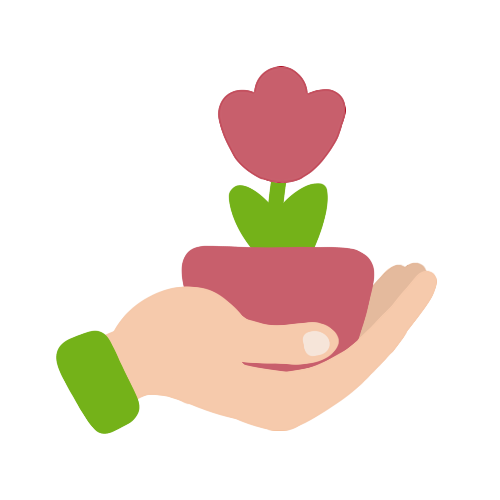

<div align="center">



# Plant Guardian

**Aplicación móvil para el cuidado inteligente de plantas de exterior e interior**


Fiorella Lucia Queirolo Chavez · Grado en Ingeniería Informática · Universidad Autónoma de Barcelona (UAB)

</div>

## 🌿 Descripción

Plant Guardian es un ecosistema digital desarrollado como **Proyecto de Final de Grado (TFG)** que combina Inteligencia Artificial y mecánicas de gamificación para transformar el mantenimiento botánico en una experiencia interactiva, educativa y personalizada.

## ✨ Características

- **Diagnóstico con IA** — Análisis avanzado de la salud de las plantas mediante fotos usando Google Gemini AI.
- **Identificación botánica** — Reconocimiento automático de especies a través de la API de Pl@ntNet.
- **Gamificación** — Sistema de niveles, puntos XP, logros desbloqueables y avatares personalizados.
- **Gestión de tareas** — Calendario dinámico de riegos con notificaciones basadas en el clima local (OpenWeather).
- **Repositorio centralizado** — Seguimiento individualizado de cada planta con persistencia de datos en la nube.

## 🛠️ Tecnología

**Backend** 
- Lenguaje — Python 3.10+
- Framework — FastAPI (arquitectura asíncrona)
- Base de datos — Supabase (PostgreSQL)
- Seguridad — JWT & Bcrypt
- Arquitectura — Estructura modular por capas (Routers, Services, Logic)

**Frontend** 
- Lenguaje — Kotlin
- Entorno — Android Studio
- Arquitectura — MVVM
- Comunicación API — Retrofit
- Gestión de imágenes — Coil
- Diseño — Material Design 3 con animaciones de transición

## 📈 Metodología

El proyecto se ha desarrollado bajo un marco **Ágil (SCRUM)**, dividido en 4 sprints. Se ha utilizado IA Generativa como soporte para la optimización de código, diseño de arquitectura y rediseño de interfaces (UX/UI).

## 📁 Estructura del proyecto

```
PlantGuardian/
├── backend/                # API REST (FastAPI)
│   ├── logic/              # Algoritmos de XP, Logros y Tareas
│   ├── routers/            # Definición de Endpoints de la API
│   ├── services/           # Integración de APIs externas (Gemini, Weather)
│   ├── schemas/            # Modelos de validación de datos (Pydantic)
│   └── database.py         # Configuración y conexión con Supabase
├── frontend/               # Aplicación Android (Kotlin)
│   ├── app/src/main/java/  # Código fuente organizado por paquetes (ui, data, tools)
│   └── app/src/main/res/   # Recursos visuales, layouts XML y estilos
├── docs/                   # Informes de progreso y documentación del TFG
└── imgs/                   # Activos gráficos (logos, iconos de logros y avatares)
```

## 🚀 Instalación

### 1. Clonar el repositorio

```bash
git clone https://github.com/tu-usuario/PlantGuardian.git
cd PlantGuardian/backend
```

### 2. Crear el entorno virtual

```bash
python -m venv venv
source venv/bin/activate        # Mac/Linux
venv\Scripts\activate           # Windows
```

### 3. Instalar dependencias

```bash
pip install -r requirements.txt
```

### 4. Variables de entorno

Crea un archivo `.env` dentro de `backend/`:

```env
SUPABASE_URL=tu_url_de_supabase
SUPABASE_KEY=tu_anon_key
GEMINI_API_KEY=tu_clave_gemini
OPENWEATHER_API_KEY=tu_clave_weather
```

### 5. Ejecutar el servidor

```bash
uvicorn main:app --reload
```

Servidor disponible en `http://127.0.0.1:8000` · Documentación Swagger en `/docs`